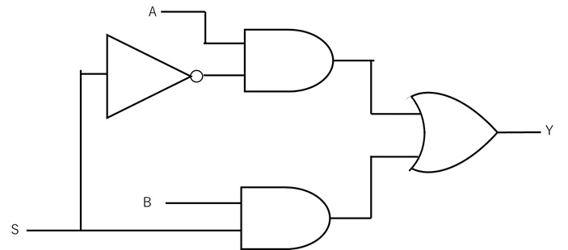
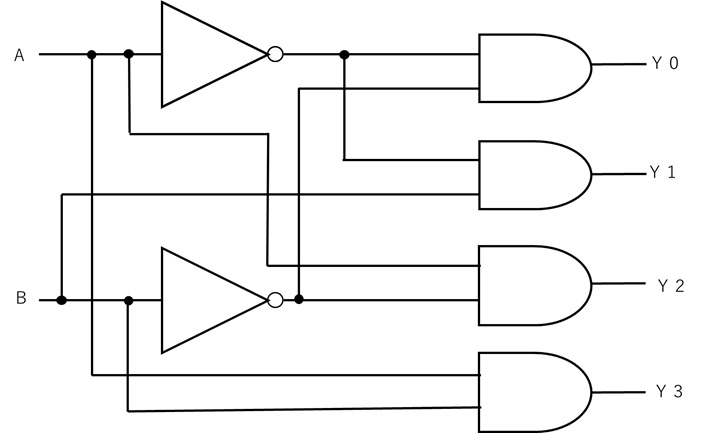
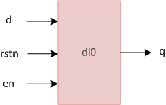

## 資料紹介　
- [スライド資料](https://www.macnica.co.jp/business/semiconductor/articles/pdf/Verilog-HDL_Trial_Text_r1__1.pdf)
- [例題集](https://www.chipverify.com/verilog/verilog-tutorial)<br>
    - verilogのサンプルコードとレストベンチが豊富
- [概論的な内容](https://ednjapan.com/edn/articles/1003/01/news112.html)
- 書籍デジタルアーキテクチャ4章 [奇数番号の回答](https://booksite.elsevier.com/9780123944245/harris_solutions_odd.pdf)<br>
    ただし、これはsystem verilogとVHDLのサンプルコードがある。system verilogでは、reg とwireの区別がないので、理解を深める上であまり嬉しくない。

# 目標
- counter やフリップフロップ、fsmのHDL記述（system verilog) とテストベンチをかけること。
- ブロッキング代入とノンブロッキング代入の違いが説明できる。


# 今までの復習
- カルノー図
- 回路記号 （xnor xorとか）　


- デジタルIC＝ロジックIC ＋メモリICに分かれます 
- 組み合わせ回路と順序回路
    - 論理回路（ロジック回路）：「組み合わせ回路」+「順序回路」+「そのほかの論理回路」
    - 組み合わせ回路は、入力で出力が決まる(wire, assign )が、順序回路は内部状態 ( reg )がある。
    - 順序回路の例：フリップフロップ、ラッチ、カウンタ　レジスタ　シフトレジスタ
    - NANDゲートやNORゲートを多く使おう（ANDゲートやORゲートよりトランジスタ数が少なくて済む。
- インピーダンス
    - high でもlow でもない状態。「Z」で示される。電気的に切り離されている。
    - 電磁誘導等による誤動作や素子破壊を防ぐため、ハイ・インピーダンス状態を伴う信号線にはプルアップ（電源（電源電圧）側に抵抗器を挿入する）またはプルダウン（接地（接地電圧、グランド）側に抵抗器を挿入する）をしよう。
- バッファ回路
    - 入力の論理値をそのまま出力とする論理回路<br>
    - スリーステート・バッファの出力は「1」、「0」、「高インピーダンス状態（Hi-Z) )
    - シュミット・トリガ : 入力が「低」から「高」に変化するしきい電圧が高めに、入力が「高」から「低」に変化するしきい電圧が低めに設定され、入力信号の揺らぎも安定
- [マルチプレクサとデコーダ](https://engineer-education.com/digital-circuit_combinational-circuit/)
    - mux 
    
    - dec
    
- 全加算機と半加算機
- ラッチとff
    - クロックエッジトリガ（ex クロックが0から1に立ち上がる）に反応するのがffで、そうでないのはラッチと呼ぶ業界ルールがある。
    - ffは電力消費があり重いので、なるべく少なく設計したい

## verilog 書式
- [スライド資料](https://www.macnica.co.jp/business/semiconductor/articles/pdf/Verilog-HDL_Trial_Text_r1__1.pdf)
- [ついでにmodelsimしたい人操作ガイド](https://www.macnica.co.jp/business/semiconductor/articles/pdf/Verilog-HDL_Trial_Lab-Manual_r1__1.pdf)
- モジュール名は英字から始める
- 小文字・大文字だけが違うモジュール名→合成時エラーが出る可能性があるため避ける
- wire & reg
    - system verilogではwire と reg　を区別せずにlogicとしてコーディングするが、wireとregの違いを考えることは設計で必須。
    - ワイヤは配線、reg はメモリー
    - wire
        - input, output はwire で行うことが多い
        - assign文でのみ代入可能
    - reg
        - always文やfunction文などで代入可能
- sequential block : from begin to end 

# practice 
- d flip flop  を書こう
```
    module ex1(
        input wire CLK,
        input wire RST,
        input wire A,
        output reg Q
        );
        always @(posedge CLK) begin
            if(!RST) Q <= 1'd0;
            else  Q <= !Q;
        end
    endmodule
```
- d ratch を書こう
    -  

## testbench 

- [testbench](https://www.macnica.co.jp/business/semiconductor/articles/intel/110605/)
- shift registerを書こう
    - [shift register]](https://www.chipverify.com/verilog/verilog-n-bit-shift-register)
- [より詳しい補足](https://technobyte.org/testbench-in-verilog/)


## memo
- md 編集方法
    - https://ashitaka.hateblo.jp/entry/2020/08/31/211817
- いずれLUTや演算機の仕組みを理解したい。
- 数字の表し方
    - 3'b001 3bit binary 001 
    - hは16進数 o は8 進数
    - 15 10進数　15
    - xは不定値、zはハイインピーダンス　：ex ) 2'b0x , 4'bzzzz
- ステートメントの終了にはセミコロン（；）
- ステートメントが複数に及ぶ場合は、begin – end 

- function
    -  関数の名前は返り値の名前
- 代入
    - ブロッキング代入 ： = 順番に行う
    - ノンブロッキング代入は、同時に行う　<=
    - case文を使用するときには = bloking 代入を行う
    - 同期の順序回路では、ノンブロッキング代入を行う